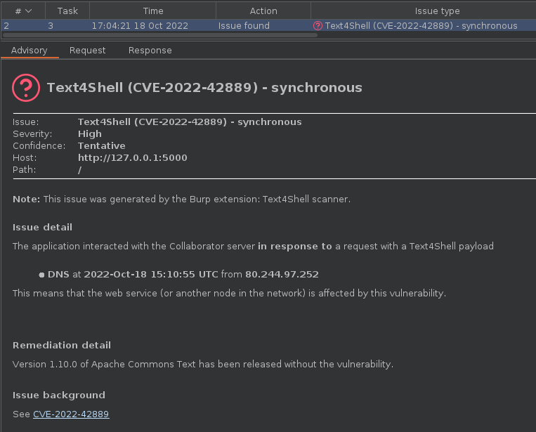

Text4Shell scanner for Burp Suite
================================

Detailed description can be found [in our blog post about this plugin][1].,

Note about detection capabilities: this plugin will only supply the built-in
active scanner with payloads, thus for optimal coverage vs. performance, you'll
have to configure your scan properly – just as with any other built-in or
extension-provided scan.

Single-issue scan
-----------------

If you'd like to scan only for CVE-2022-42889 (and not other things such as
XSS or SQLi), this plugin makes it possible.

By following the instructions below, the scanner will only
perform Text4Shell checks on all insertion points if the scan configuration
created as a result is used.

1. When creating a new scan, click `Select from library` on the `Scan configuration` tab
2. Pick `Audit checks - extensions only` which is built into Burp Suite Pro 2.x
3. Disable every other extension (if applicable) that have an active scan check registered (such as ActiveScan++, Backslash powered scanning, Burp Bounty, etc.) so that only the Text4Shell scanner runs

Building
--------

Execute `./gradlew build` and you'll have the plugin ready in
`build/libs/burp-text4shell.jar`

License
-------

The whole project is available under the GNU General Public License v3.0,
see `LICENSE.md`.

[1]: https://blog.silentsignal.eu/2022/10/18/our-new-scanner-for-text4shell/
